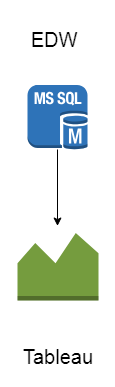
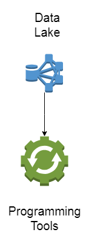
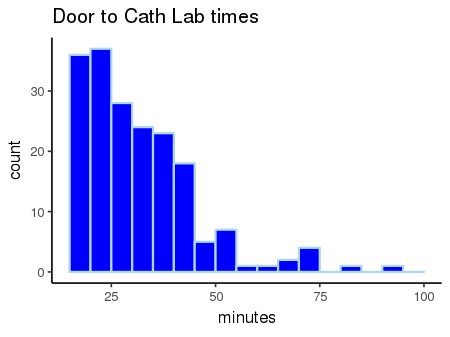
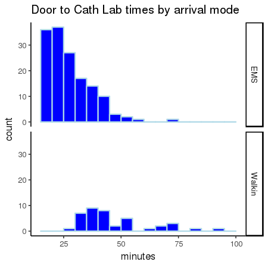
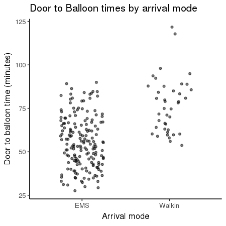
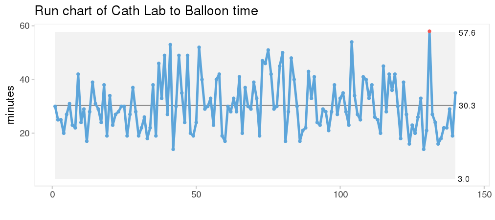
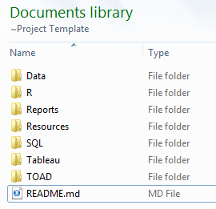

```{r setup, echo = FALSE, warning = FALSE, message = FALSE}
library(dplyr)
options(htmltools.dir.version = FALSE)
```


### Introduction
- Manager Quality & Analytics - PHC
- RN (ICU, ED and Transport)
- Computer enthusiast (programming/webmaster/data science)


???
about me test

---

# We're going to talk about...

- An approach to analytics
- Terminology
- Starting with the right questions
- Epic Data sources
- Importance of visualizing data
- A few practical tips for getting started


---
background-image: url("Sentara Health Campus.jpg")
background-size: cover
class: center, bottom, inverse


???
Looks like a maze but it's not

Prayer, medidation * mindfullness

State your intention before entering: 
- anything that is troubling you
- "I want a solution to my problem with..."

---

# The Maze and the Labyrinth


.pull-left[
```{r, echo = FALSE}
knitr::include_graphics("768px-Prim_Maze.svg.png")

```

]

.pull-right[

### Maze
1. Goal is to reach the destination

1. Multiple entrances, exits, and dead-ends.

1. Difficult to recall/reproduce the route

]


---

# The Maze and the Labyrinth


.pull-left[
```{r, echo = FALSE}


```

]

.pull-right[

### Labyrinth
1. Goal is to find peace and understanding

1. Single route to the center and back to entrance

1. Can easily reproduce how we got there

]

---

## Terminology 

.pull-left[

#### Report
- Tabular data
- Excel files, on-screen or printed
- Reporting Workbench/InfoView

#### Dashboard
- Multiple graphs or plots
- Interactive or static
- Tableau/Vantage/etc.


]

--

.pull-right[
#### Raw Data
- No formatting or plots
- Intended for computers
- Excel or .csv format

]


---

## Terminology 

.pull-left[
#### Clinical Analytics
- planning/data collection
- cleaning/preparation
- analysis
- data presentation

]

--

.pull-right[

#### Data Science
- a formal discipline of turning raw data into understanding, insight, and knowledge. 
- Programming tools instead of GUI software
- Computer science & statistics
]


--

#### The Data Science process
```{r, echo = FALSE, fig.align = 'center'}
knitr::include_graphics("data-science.png")

```

---

## What types of Analytics requests are you getting?

--
- "I need a report..."
- "Can we 'tweak' this dashboard to ..." 
- "Can you pull a list of patients ..."
- "I just need a ..."


--

   > What they __request__  
   > is not always what they __want__  
   > which may not be what they __need__
  
---
## Restate the issue

- "What question(s) are you trying to answer?"
- "What problem are you trying to solve?"

--
- 5 Whys

--
- User Stories

> "As a `<type of user>`,  
> I want `<some goal>`   
> so that I can `<some action>`."  


---
## Restate the issue

### PICOT
   - Population
   - Intervention
   - Comparison
   - Outcome
   - Time


> Among patients with ICD implants, did the use of antibiotic pouches decrease the incidence of infection compared to patients without pouches over the past 5 years?


---
## Restating the issue

### Clinical Analysis
 - What is being requested? Purpose or use? 
 - Population of interest - Inclusions & Exclusions 
 - Intervention or comparision groups?
 - Outcomes/Variables?
 - Date Ranges? 

---

# Data requirements

- What raw data is required?
- What level of detail? 
   - individual patients
   - procedures
- What are the potential data sources?
- Do multiple datasets need be merged?
- Any modifications? (cleaning or reshaping)

--

.pull-left[
#### Long data

```{r, echo = FALSE}
mydata <- dplyr::tribble(
  ~CSN, ~MEAS_NAME, ~Value,
  "1234", "BP", "118/80",
  "1234", "Pulse", "80",
  "1234", "Resp", "16",
  "5678", "BP", "142/90",
  "5678", "Pulse", "65",
  "5678", "Resp", "22"
   
)

knitr::kable(head(mydata), format = 'html')

```
]

--

.pull-right[
#### Wide data

```{r, echo = FALSE}
mydata_wide <- 
  mydata %>%
  tidyr::spread(MEAS_NAME, Value) %>%
  dplyr::mutate(SBP = gsub("/.*", "", BP)) 

knitr::kable(mydata_wide, format = 'html')

```
]


---

background-image: url("Analytics_environment.svg")
background-size: contain
class: center, top, inverse

### Epic Data Sources

---
# Data Sources 


.pull-left[
## Chronicles
- Column-store database
- Cache (multiple servers)
- Updated: Real-time
- Suited for single patient data and short time-frames
- Access via Reporting Workbench

#### Food metaphor ---> U-pick farm
]

.pull-right[
```{r, echo = FALSE, fig.align = 'center'}


```

]


---
# Data Sources 

.pull-left[
## Clarity

- Traditional relational database
- Oracle (single server)
- Thousands of tables
- Epic data only
- Updated: Nightly
- Access via InfoView and Hyperspace (Crystal Reports)

#### Farmer's market (rural setting)
]

.pull-right[
```{r, echo = FALSE, fig.align = 'center'}


```

]


---
# Data Sources

.pull-left[
## Enterprise Data Warehouse (EDW)

- Relational database
- Microsoft SQL Server (single server) 
- Copy of Clarity (most tables)
- Updated: Nightly
- Multiple data sources, not just Epic
- Access via Tableau & programming tools (SQL)

#### Farmer's market (urban setting)
]

.pull-right[
```{r, echo = FALSE, fig.align = 'center'}


```

]

---
# Data Sources

.pull-left[
## Data Lake (EDL)

- Data is distributed across a cluster of multiple servers 
- "Schema-on-read"
- Updated: Weekly and Monthly
- Synergy - standardized data from Epic and Meditech
- Access via programming tools (SQL, R, Scala, etc.)

#### Grocery Store
]

.pull-right[
```{r, echo = FALSE, fig.align = 'center'}


```

]


---
# Data Sources

.pull-left[
## HANA

- Data is loaded in RAM rather than disk
- Curated (limited) datasets
- Updated: Monthly
- Access via Webi & Tableau

#### Blue Apron (meal delivery)
]

.pull-right[
```{r, echo = FALSE, fig.align = 'center'}


```

]


---

# Visualization

Time intervals for STEMI patients admitted to the Emergency Department.

```{r, echo = FALSE}
dtb <- readRDS(file = "dtb.rds")


knitr::kable(head(dtb, n = 6), format = "html")


```


__d2cl__: Door to Cath Lab (ED arrival)  
__cl2b__: Cath Lab to Balloon (definitive treatment)  
__d2b__: Door to Balloon (overall elapsed time)  


---

# Visualization

### Histograms

```{r, echo = FALSE, fig.align = 'center'}


```

---

# Visualization

### Histograms

```{r, echo = FALSE, fig.align = 'center'}


```


---

# Visualization

### Dot plots

```{r, echo = FALSE, fig.align = 'center'}


```

---

# Visualization

### Run charts


```{r, echo = FALSE, fig.align = 'center'}


```


---

# Some Tips


.pull-left[

Organize analytics projects in a __standard file structure__

- Always keep an unmodified version of the original raw data
- `Reports:` contains the final analysis
- `Resources:` Reference documents, articles, etc.
- `SQL/R/Tableau:` Any programming code used in project
- README document contains information about the project intent, etc.

]

.pull-right[
```{r, echo = FALSE, fig.align = 'center'}


```

]

---

# Some Tips

Raw data files should be __tidy__.
- Each table is an observational unit (ie. patient vs. procedure)
- Each row is a single observation
- Each column is a single variable

.pull-left[

```{r, echo = FALSE, fig.cap = ""}
messy <- dplyr::tribble(
  ~CSN,  ~`Age/sex`, ~`Diagnosis/Admit_date`, 
  "123", "72 F", "Acute MI", 
  " ",    " ",    "2018-07-04",
  "456", "68 M", "Stroke", 
  "  ",   " ",     "2018-08-01"
)

knitr::kable(head(messy), format = 'html', caption = "messy data")

```
]

.pull-right[

```{r, echo = FALSE}
tidy_data <- dplyr::tribble(
  ~CSN,  ~Age, ~Sex, ~Diagnosis, ~Admit_date, 
  "123", "72", "F", "Acute MI", "2018-07-04",
  "456", "68", "M", "Stroke",   "2018-08-01"
)

knitr::kable(head(tidy_data), format = 'html', caption = "tidy data")

```
] 

---


# Some Tips

Data from different sources can be __joined__ using identifier fields (ie. MRN, HAR, CSN)

.pull-left[
_Demographics_

```{r, echo = FALSE}
demog <- dplyr::tribble(
  ~CSN,  ~Diagnosis, ~Admit_date,
  "1234", "Acute MI", "2018-07-04",
  "5678", "Stroke", "2018-08-01"
)

knitr::kable(head(demog), format = 'html')

```

]

.pull-right[
_Vitals_

```{r, echo = FALSE}
knitr::kable(head(mydata_wide), format = 'html')

```
]


```{r, echo = FALSE}
demog %>%
  inner_join(mydata_wide, by = "CSN") %>% 
  knitr::kable(., format = 'html')
  

```

--

This means that you aren't limited to using a single data source or reporting system.


---

# Wrap up


1. Start with good questions 
1. May need multiple data sources
1. May need to prep the data for analysis 
1. Visualizations can help find patterns


---
background-image: url("pmp_labyrinth.png")
background-size: cover
class: center, bottom, inverse

# Thanks!

Slides created via the R package [**xaringan**](https://github.com/yihui/xaringan).

