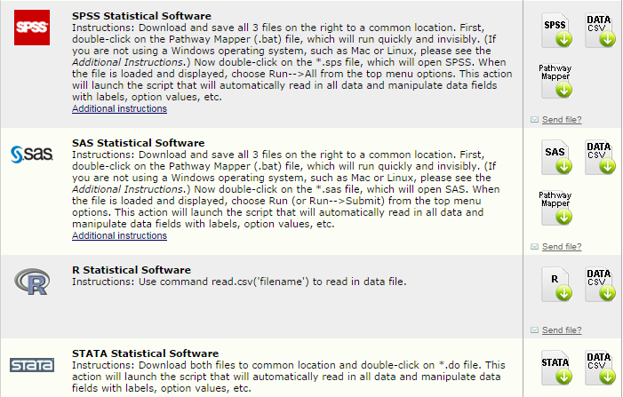
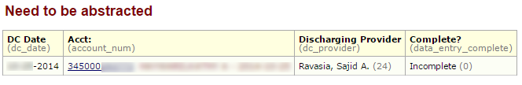

## Improved data management
<div class="columns-2">
### Motivation
- Used Excel for nearly everything
- Excessive time spent manipulating data, cleaning/fixing errors, etc. 
- Needed Decentralized data collection
- Attempted: Access, InfoPath, Sharepoint, others


###  Needed a solution that was:  
 - Inexpensive and no new desktop software (Cheap)  
 - Compliant / Data Management Best Practices  (Good)
 - Easy to develop, deploy & use (Fast) 


</div>

```{r venn_fcg, eval=FALSE, echo=FALSE, message=FALSE,fig.height=6}
library(venneuler)

fgc <- venneuler(c(#Fast=3, Good=3, Cheap=3,
                  "Fast"=2.6,
                  "Good"=2.6,
                  "Cheap"=2.6,
                  "Fast&Cheap"=.8,
                  "Cheap&Good"=.8,
                  "Good&Fast"=.8),
                labels=c("Fast", "Good", "Cheap")
                )
png("REDCap Intro/images/fcg_venn.png", width = 4, height = 4, units = 'in', res = 400)
plot(fgc)
dev.off()

```


## What is REDCap?
<div class="columns-2"> 


- Secure, web-based application for building and managing online surveys and databases.
- Primary focus is data management for clinical research.
- HIPAA/HITECH compliant. Can be used in 21 CFR Part 11, FSMA and EU/international environments.
- Free for REDCap consortium members (Funded by NIH grant).


### Fits in somewhere with...


</div>
 
```{r venn, eval=FALSE, echo=FALSE, message=FALSE,fig.height=6}
library(venneuler)

vd <- venneuler(c(Excel=2.6, Access=2.5, Sharepoint=2.3, SurveyMonkey=2.3, SelectSurvey=2.2, EpiInfo=2.0, Velos=2.1, REDCap=5,
                  "REDCap&Excel"=0.5,
                  "REDCap&Access"=0.5,
                  "REDCap&Sharepoint"=0.5,
                  "REDCap&SurveyMonkey"=0.5,
                  "REDCap&SelectSurvey"=0.5,
#                  "REDCap&PATS"=0.5,
                  "SurveyMonkey&SelectSurvey"=0.25,
                  "REDCap&Velos"=0.5,
                  "REDCap&EpiInfo"=0.5,
                  "Excel&Access"=0.75,
                  "Excel&Sharepoint"=.75
                  ),
                labels=c("Excel/Access", "Sharepoint/Infopath", "SurveyMonkey/SelectSurvey", "Velos/PATS")
                )
png("REDCap Intro/images/REDCap_venn.png", width = 6, height = 6, units = 'in', res = 300)
plot(vd)
dev.off()

```


## >1200 Institutions Worldwide 
Vanderbilt - 17,000 users & 8900 projects  
Harvard Catalyst/Partners - >8000 users & 2000 projects


<div class="notes">
<div class="columns-2">
### Worldwide
- 1200 institutional partners
- 86 countries
- 181,000 users

### Local
- 130 projects
- 215 users
</div>
</div>


## Local Usage 
<div class="columns-2">
### QI Registries
- Cardiac Level I
- Transcatheter Valve Cases
- Total Joint Replacements

### QI Audits
- Spine Center of Excellence 
- Sepsis Bundle compliance
- Delirium (CAM) screening
- Diabetes Management audits

### Operational Projects
- PMG Unusual Occurance Reports
- Quantros Events


### IRB-approved Research  
- PostAnesthesia Events  
(CodeBlue/Stroke)
- Spine Surgery & IV Tylenol
- Pneumonia Case tracker 

<div>

<div class="notes">
### Chart audits & Registries
 - Sepsis Bundle compliance, Cardiac Level 1, PCI mortality reviews
 - PostAnesthesia Adverse Events (CodeBlue) 
 - TAVR case management
</div>

<!-- Hide 

## Key Features
### Usability

 - Fast & Easy to Use  
 - Flexible  
 - Autonomous utilization

### Security  

 - Individual Access  
 - Role-based permissions
 - Protected Health Information (PHI)
 - Audit trails  


### Data Quality  

 - Data Validation  
 - Data Export 


<div class="notes">

- Intuitive user interface that streamlines the design process. No database experience is needed to begin using the software. Built-in online support/training videos
- Users can independently make project modifications, even after data collection has begun.
- Project owners have autonomy and control to add new users

- Providence Network ID/password, Providence internal network access only, HIPAA/HITECH compliant.
- PHI fields can be removed from data exports. Dates can be shifted randomly.
- Who did what when. Logs when data was changed, viewed, or exported.
- control access to different roles, forms & functions

- restrict data entry using picklists, number ranges, dates, etc.
- Data Quality rules can check for logical integrity
- reduces burden during analysis/reporting


</div>


## Data Entry


### Field types
Text, numeric, dates, Yes/No, long paragraphs, pick lists, check boxes, radio buttons, Visual Analog Scale slider.

<div class="notes">
This is just a basic view of a typical data entry form.
</div>


## Activity Log


<div class="notes">
This shows the type of information tracked in the activity log.
</div>


## Protected Health Information


<div class="notes">
This shows the various options for de-identifying data exports.
</div>


## User Access / Roles


<div class="notes">
This shows the settings for end-user permissisions. 
</div>


## Data Exports


<div class="notes">
Raw data and syntax files
</div>


-- END Hide --> 


## Catheter Audits 
<div class="columns-2">
Nursing audits to reduce the incidence of catheter-associated urinary tract infections. 

1. Physical audit of patient
2. Chart reviews of nursing documentation


#### Requirements  

- Data collection by nursing unit managers
- calculate the compliance rates with best practices and policies


[Live Demo](https://ssl.providence.org/redcap/redcap_v6.0.1/DataEntry/,DanaInfo=redcap.providence.org+index.php?pid=280&id=1&page=cauti_audit&event_id=683) 

</div>


## Psychiatric QI Initiatives

1. Admission screening for substance abuse
2. Plan of care sent to next provider 

Both initiatives are paper-based workflows

#### Requirements  

- Identify all elligible psychiatric patients
- calculate the compliance rates
- identify reasons for missing forms/items (patient refused vs. not offered)
- timely feedback to leaders & staff


## Psychiatric QI Initiatives

### Automated Import

- SQL query to get previous week's discharges  
- API to import the new cases into REDCap
 
```{r eval=FALSE}
## scheduled script on Mondays at 2am
new_cases <- edwQuery("Psych_discharges.sql")
write_redcap(new_cases)
```


### Auditor's workqueue in REDCap


## Psychiatric QI Initiatives


## Psychiatric QI Initiatives


## Transcatheter Valve Cases
<div class="columns-2">

90 cases/year, 55% by non-Providence cardiologists

CMS mandates tests, labs, and patient-reported outcomes (KCCQ) at   
Preop, 30days and 1 year Postop.

TAVR Coordinator for overall program & one at each non-Providence clinic.

#### Requirements  

- track overall referrals to Providence Spokane Heart Institute Valve program
- monitor the status of each patient longitudinally
- capture additional data elements
- isolate non-Providence clinic's data


[Live Demo](https://ssl.providence.org/redcap/redcap_v6.0.1/DataEntry/,DanaInfo=redcap.providence.org+record_status_dashboard.php?pid=292) 

</div>


## Total Knee Replacements
<div class="columns-2">

Multiple surgeons/Anesthesiologists using different multi-modal pain control regimens:  

 - IV Acetaminophen
 - Exparel
 - On-Q pump
 - Femoral Nerve block 
 - various other medications

Simultaneously implementing Obstructive Sleep Apnea screening (STOP-BANG) protocol 


#### Requirements  

- multiple chart reviewers  
- calculate the Morphine-Equivalent Daily Doses (MEDD)
- de-identified data for statistical analysis (propensity-score matching)


[Live Demo](https://ssl.providence.org/redcap/redcap_v6.0.1/DataEntry/,DanaInfo=redcap.providence.org+index.php?pid=230&page=demographics&id=202&event_id=622) 

</div>


## Additional Resources

  [Data Management for Clinical Research](https://www.coursera.org/course/datamanagement) - Oct 27th  

This free 5 week course by Vanderbilt/Coursera is designed to teach important concepts related to research data planning, collection, storage and dissemination. 

  [OCTRI](http://www.ohsu.edu/xd/research/centers-institutes/octri/resources/octri-research-services/project-based-data-collection.cfm) OHSU REDCap site

  [ITHS](https://www.iths.org/RCBG) U of W REDCap site


## Choose Your Own Adventure
<div class="columns-2">

### Live Demo
[Total Joint Replacements](https://ssl.providence.org/redcap/redcap_v6.0.1/DataEntry/,DanaInfo=redcap.providence.org+index.php?pid=230&page=demographics&id=202&event_id=622) 
  
[Transcatheter Valve Cases](https://ssl.providence.org/redcap/redcap_v6.0.1/DataEntry/,DanaInfo=redcap.providence.org+index.php?pid=230&page=demographics&id=202&event_id=622) 

[GAMUT Database](https://ampa.org/redcap/redcap_v6.0.1/DataEntry/record_status_dashboard.php?pid=26) 

[Create a new project](https://ssl.providence.org/redcap/,DanaInfo=redcap.providence.org+index.php?action=create)

### More Details

[Technical](#)  

[Security](#)  

[Advanced Features](#)  

[Enterprise-wide requirements](#)  

</div>


<div class="notes">
###What would you like to see?

### Demo
Total Joint - data entry, branching logic, de-identified data export  
Create - ease of creating a project  

Technical - current and future requirements  
Security - user and server details
Advanced - more advanced features  
Enterprise deployment

</div>


## Technical Details

- Based on PHP & MySQL
- Windows/IIS or Linux/Apache
- Application webserver and database server on single server
- Data stored in Entity Attribute Value format (long, narrow table)

[Back...](#13 target=self)


## Enterprise-wide deployment

### Technical requirements

 - Active Directory universally
 - Separate web & database servers. 
 - Forward-facing with SSL (https) encryption
 - At-rest encryption
 - Permit email to pass through firewall
 
## Enterprise-wide expansion
### Operational Requirements

- Server support (IT)
- Application support (centralized) 
    - upgrades
    - plugins
    - configuration
- End-user support (de-centralized) 
    - education 
    - promotion
    - best-practices
    - project support


[Back...](#13 target=self)


## Security
### Users  

- ActiveDirectory to logon
- Access to individual projects
- Expiration dates
- Record Locking

### Server  

 - Located in Sabey Datacenter (single server) 
 - Accessible from internal network only
 - Active Directory for PHSWA domain currently

[Back...](#13 target=self)


## Advanced Features

- Data Quality Rules
- Data Queries 
- Basic Reports
- Longitudinal Data
- Calculated Fields
- Randomization
- Dual Data Entry
- Plugins
- API Import/Export

[Back...](#13 target=self)
