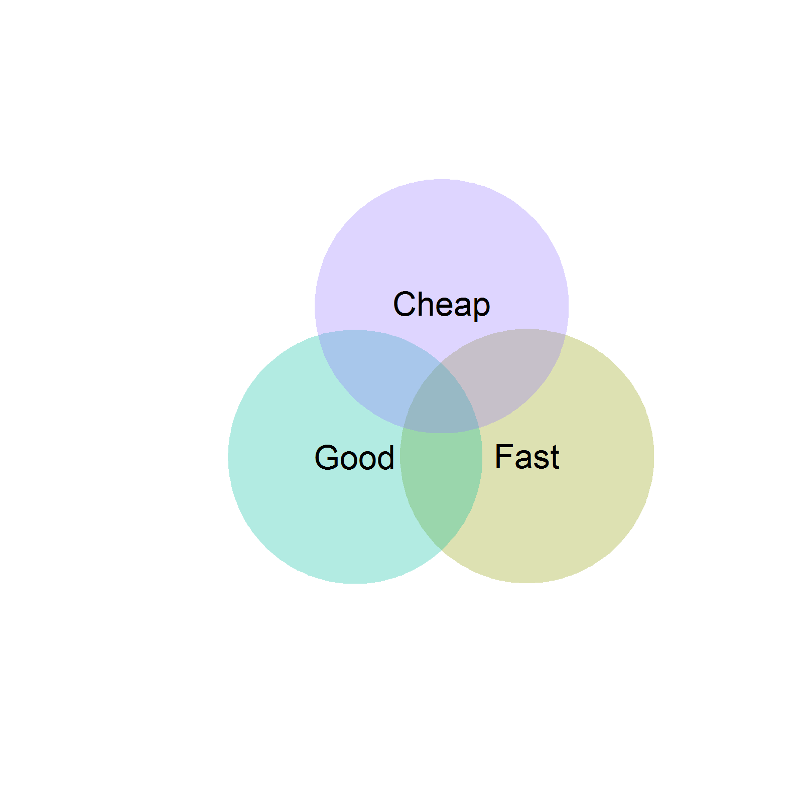

## Why REDCap?
<div class="columns-2">
### Motivation
- Used Excel for nearly everything
- Needed Decentralized data collection
- Excessive time spent manipulating data, cleaning/fixing errors, etc. 

###  Needed a solution that was:  
 - Inexpensive and no new desktop software (Cheap)  
 - Compliant / Data Management Best Practices  (Good)
 - Easy to develop & use (Fast) 


</div>

```{r venn, eval=FALSE, echo=FALSE, message=FALSE,fig.height=6}
library(venneuler)

fgc <- venneuler(c(#Fast=3, Good=3, Cheap=3,
                  "Fast"=2.6,
                  "Good"=2.6,
                  "Cheap"=2.6,
                  "Fast&Cheap"=.8,
                  "Cheap&Good"=.8,
                  "Good&Fast"=.8),
                labels=c("Fast", "Good", "Cheap")
                )
png("REDCap Intro/images/fcg_venn.png", width = 4, height = 4, units = 'in', res = 400)
plot(fgc)
dev.off()

```

