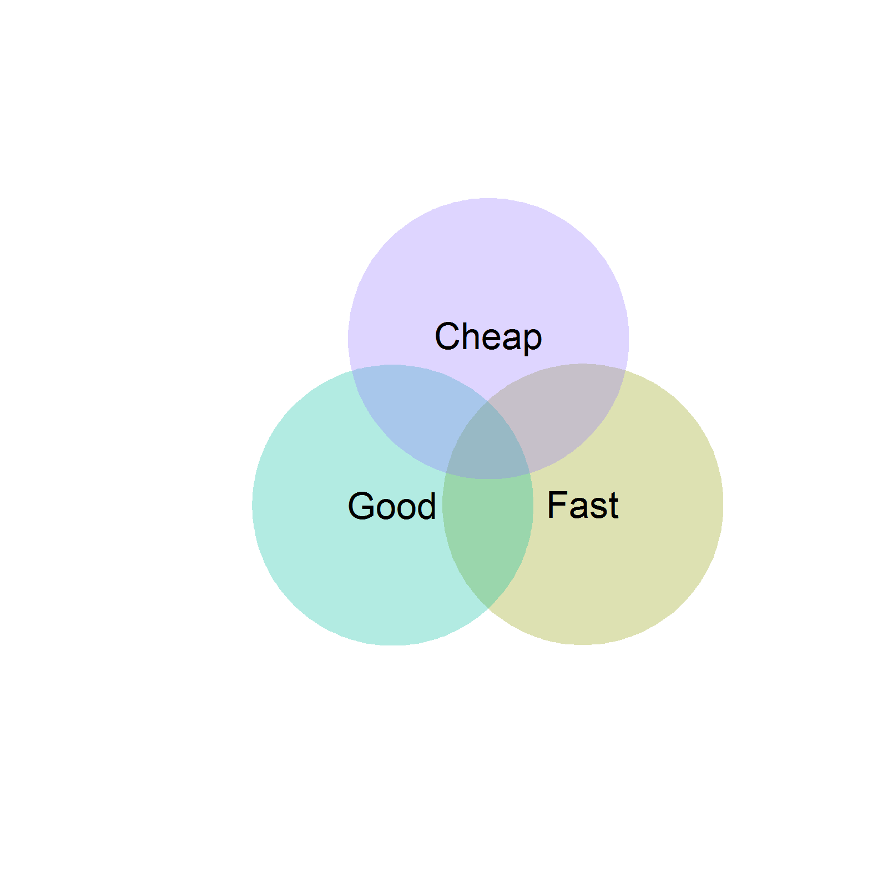
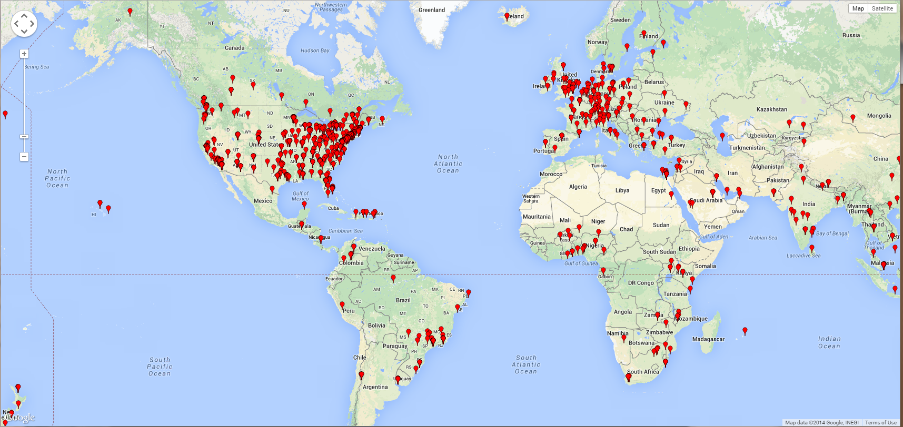
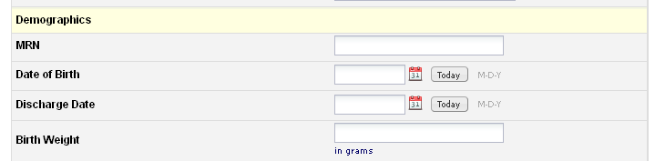
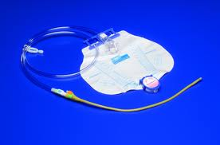
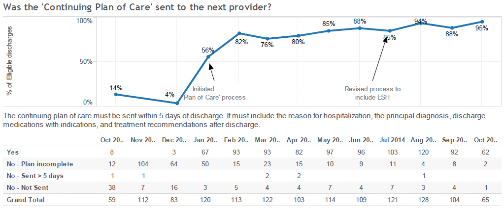

## Quality Improvement data
<div class="columns-2">
### Motivation
- We used Excel for nearly everything
- Excessive time spent copying & pasting data, emailing files, cleaning/fixing errors, etc.

###  Needed a solution that was:
 - Inexpensive and did not require software installation (Cheap)
 - Compliant / Data Management Best Practices  (Good)
 - Easy to develop, deploy & use (Fast)


</div>

```{r venn_fcg, eval=FALSE, echo=FALSE, message=FALSE,fig.height=6}
library(venneuler)

fgc <- venneuler(c(#Fast=3, Good=3, Cheap=3,
                  "Fast"=2.6,
                  "Good"=2.6,
                  "Cheap"=2.6,
                  "Fast&Cheap"=.8,
                  "Cheap&Good"=.8,
                  "Good&Fast"=.8),
                labels=c("Fast", "Good", "Cheap")
                )
png("REDCap Intro/images/fcg_venn.png", width = 4, height = 4, units = 'in', res = 400)
plot(fgc)
dev.off()

```


## What is REDCap?


- Secure, web-based application for building and managing online surveys and databases.
- Primary focus is data management for clinical research. 
- Free (Funded by NIH grant).


### Key Features

- Intuitive user interface that streamlines the design process. 
- No database experience is needed to begin using the software. 
- Built-in online support/training videos
- Users can independently make project modifications, even after data collection has begun.
- Project owners have autonomy and control to add new users


## >1700 Institutions Worldwide




## How it's used locally
<div class="columns-2">
### QI Registries
- Cardiac Level I
- Transcatheter Valve Cases
- Total Joint Replacements

### QI Audits
- Sepsis Bundle compliance
- Delirium (CAM) screening
- Diabetes Management audits

### Operational Projects
- PHC Serious Safety Events
- Workplace Violence Log


### IRB-approved Research
- Prescription Drug Assistance Program
- Spine Surgery Pain Protocol
- Nursing Barriers to Patient Mobility

<div>


## Data Entry



### Field types
Text, numeric, dates, Yes/No, long paragraphs, pick lists, check boxes, radio buttons, Visual Analog Scale slider.

<div class="notes">
This is just a basic view of a typical data entry form.
</div>


## Catheter Audits
<div class="columns-2">
Nursing audits to reduce the incidence of catheter-associated urinary tract infections.

1. Physical audit of patient
2. Chart reviews of nursing documentation


#### Requirements

- Data collection by nursing unit managers
- calculate the compliance rates with best practices and policies




</div>


## Psychiatric QI Initiatives

1. Admission screening for substance abuse
2. Plan of care sent to next provider


#### Requirements

- Identify all elligible psychiatric patients
- calculate the compliance rates
- identify reasons for missing forms/items (patient refused vs. not offered)
- timely feedback to leaders & staff


## Psychiatric QI Initiatives




## Additional Resources

  [OCTRI](http://www.ohsu.edu/xd/research/centers-institutes/octri/resources/octri-research-services/project-based-data-collection.cfm) OHSU REDCap site

  [ITHS](https://www.iths.org/RCBG) U of W REDCap site

