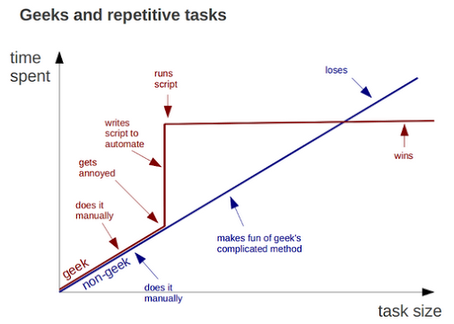

RStudio Introduction
========================================================
author: Rollie Parrish
date: Sept 22, 2014


===




text
=====

Now that we have (or are close to having) a system-wide distribution of R and RStudio, would you be willing to take the September PAIG and give an introduction to R?  I’m thinking the basics of using files vs the console, maybe knitr (though a full meeting devoted to the principles and practice of reproducible research is also warranted), how to install new packages, some of the essential packages from your perspective, and how to learn R (maybe pointing to something like swirl but also where you go when you need help, possibly online courses, whatever).


Intended Audience
=====

- understand pros/cons of programming vs. point-and-click
- already familiar or used R in past
- currently using R console


What is R?
===
- Software for data manipulation, analysis and graphics display
- Interactive and functional programming language
- "Domain specific" - statistics, data science & analysis
- Extended funtionality via functions and packages


How is R used here?
===

- Data Cleanup (HBIPS)
- Extract, Transform, Load (REDCap & Stix Employee Health)
- Ad-Hoc Analysis (WarmShots and Ventricular Fibrillation)
- Reporting (MDRC Prov. Cardiac Surgery reports, GAMUT)
- Statistical Modeling (more to come)
- This presentation (!)


RStudio
===

Integegrated Development Environment for working with R scripts, packages, and final output.

Intended for programming, NOT a Graphical User Interface for R. Other GUI packages available such as:

- R Commander
- Deducer
- JGR
- Rattle


RStudio demo
====

- Menu bar
- Panels
- Options


R basics
=======

### assignment
assigns variable name on left the value(s) to the right

`variable_name <- value`


```r
tax <- .08
item <- c("soda", "sandwich", "book", "bike")
prices <- c(1.00, 6.00, 30.00, 1500)
```


R basics
=======
### vectorization


```r
tax <- prices * tax
```


### variables can be

- single values
- vectors (same class of data - strings, numeric, etc.)
- lists (mixed classes of data)
- data frames - tables of data, columns are the same class


R basics
=======
### data frames


```r
invoice <- data.frame(item, prices, tax)
invoice
```

```
      item prices    tax
1     soda      1   0.08
2 sandwich      6   0.48
3     book     30   2.40
4     bike   1500 120.00
```


RStudio demo (cont.)
=======

- load data csv
- load from SQL
- load via API
- dim
- summary
- plots


Key Themes
===
- Reproducible Analysis/Research
- Project Management
- Automation


Reproducible Analysis
==================


Projects
==================


Automation
==================


Recommended R Packages
======================

 - RODBC
 - dplyr
 - compareGroups
 - ggplot2


Other R Resources
===

- https://www.datacamp.com/
- https://www.codeschool.com/courses/try-r
- http://www.statmethods.net/
- http://www.twotorials.com/
- http://www.youtube.com (search "R tutorial")
- http://www.coursera.org

Book Recommendations
===

- R in Action (Kabacoff, 2014)
- R for Everyone (Lander, 2013)
- R Graphics Cookbook (Chang, 2013)

Help: "How do I..."
====

## `?command`
  internal help

## http://stackoverflow.com

(search with [r] tag)

Always include a 'minimally reproducible example' of the issue


Advanced Topics
===
- Version Control (Git)
- Writing Packages


