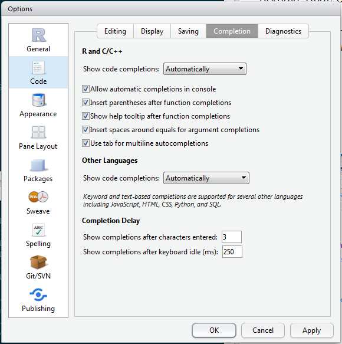
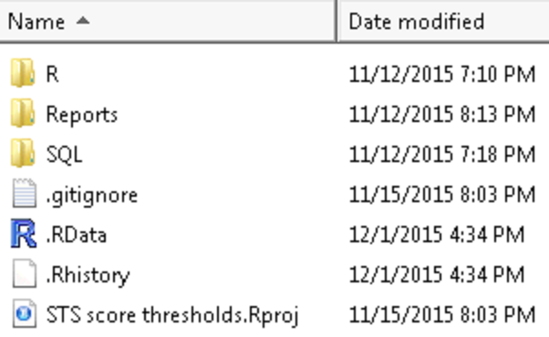

Rstudio features
========================================================
author: Rollie.Parrish@providence.org
date: 2015-11-25
autosize: true


Overview
===============
R Studio v. 99.451

- Code completion
- View() function
- Projects


RStudio: Code Completion
==================



***

 - all available objects (vectors, data frames, functions, etc.)
 - installed packages
 - files
 - works in dplyr pipelines
 - inline help tooltips
 - formula arguments

## To enable, go to:
Tools --> Global Options --> Code --> Completion


RStudio: Code Completion walkthrough
==================


<!--
# remember to setwd() to source file location
# enter each line in console window
-->


```r
suppressWarnings(library(dplyr))

# load("Data/seattle_911.rda")

# glimpse(seattle_911)

# seattle_911 <- mutate(seattle_911,
#                      Type = as.factor(Type))

# seattle_911 %>%
#         select(Type, Datetime) %>%
#         count(Type, sort = TRUE)

# seattle_911 %>%
#        group_by(lubridate::floor_date(Datetime, unit = "hour")) %>%
#        tally() %>%
#        with(., plot(n, type = "b"))
```

- Seattle Fire Department calls on 2015-07-08
- Source: data.seattle.gov


RStudio: View()
===============

Used to inspect dataset interactively, similar to Excel's AutoFilter


- factors --> picklist
- continuous --> slider
- text search
    - global vs individual columns
    - incremental search
    - pop-out browser
- refreshes when data frame is modified


RStudio: View() walkthrough
===============


```r
mydata <- seattle_911
View(mydata)

#
mydata <- filter(mydata, Type == "Rescue Elevator")
```


Projects
========

Useful when working on different analysis projects

Keeps all the associated files project files together
 - scripts, data files, figures, reports
 - dedicated R workspace and history
 - Sets the working directory & other options
 - Loads source files when project is re-opened


***



Questions?
=========


