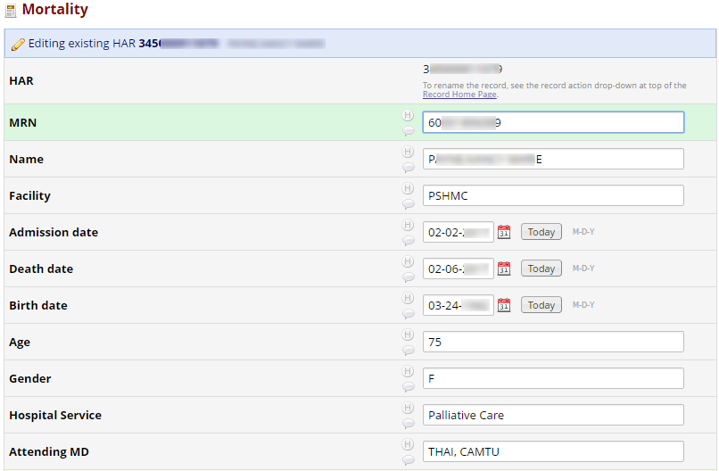

# Types of Data Science

### Type A 
> The A is for Analysis. This type is primarily 
> concerned with making sense of data or working with it in a fairly static way. 
> The Type A Data Scientist is very similar to a statistician (and may be one) 
> but knows all the practical details of working with data that aren’t taught 
> in the statistics curriculum: data cleaning, methods for dealing with very 
> large data sets, visualization, deep knowledge of a particular domain, 
> writing well about data, and so on.

---

# Types of Data Science

### Type B  
> The B is for Building. Type B Data Scientists share some statistical background 
> with Type A, but they are also very strong coders  and may be trained software 
> engineers. The Type B Data Scientist is mainly 
> interested in using data “in production.” They build models which interact 
> with users, often serving recommendations (products, people you may know, 
> ads, movies, search results).

> Michael Hochster (Quora post)

[Doing Data Science at Twitter - Robert Chang](https://medium.com/@rchang/my-two-year-journey-as-a-data-scientist-at-twitter-f0c13298aee6#.74wf3wyka)


---

# Comparison

Common approaches: 
 - Programming Languages (R/Python/SAS/Julia/Scala, etc.)
 - SQL 
 - Regular Expressions
 - Version Control

.pull-left[
## Type A - analysis

Smaller Datasets  
Traditional Statistics 

Output: 
  - Analysis (written report, presentation, blog post, article)
  - Data Wrangling
  - Automation/ETL
]
  
.pull-right[
## Type B - build
"Big Data"  
Machine Learning/Deep Learning  

Output: 
  - Applications
  - Large scale models
  - Recommender systems
]

---

# Approach 


1. R / R-Studio
2. R Packages
  - tidyverse
  - dplyr & magrittr (pipes)
  - ggplot2
  - Rmarkdown


.footnote[
[1] [Source: R for Data Science](http://r4ds.had.co.nz/index.html)
]


---
# Examples 

- Mortality Reviews
- TYRX pouch utilization
- Provider Contract Incentives

---

# Basic ETL Example - Mortality Review 


```{r, eval = FALSE}
## Get patients from EDW
mortalities <- edwSQL("SQL/Mortalities.sql", resource="EDWDBProd")

## Send to REDCap
uri <- "https://redcap.providence.org/redcap/api/"

redcap_write(mortality_cases, redcap_uri = uri, token = token)
```



---

# Tyrx antibiotic pouch

## Prompt  
 - Are there significant differences in demographics or proposed criteria between
patients with devices only vs devices with TYRX?
 - How many cases met the proposed ’appropriateness’ criteria?
 
## Methods
 - Case list from ICD Registry - demographics & clinical criteria
 - ICD Infections from ICD Infection database (REDCap)
 - TYRX pouch data from EDW
 
[Tyrx Utilization.pdf](TYRX Utilization.pdf)


---

# Provider Contracts - Quality Incentives

## Prompt  
 - Determine if quality data can be obtained
 - Set benchmarks (trends and targets)
 
## Methods

 - Get the Initial population (demographics and surgeons)
 - Separate query for each metric
 - JOIN data sets in R (dplyr)
 - .csv files vs SQL
 
 
[Surgical Incentive Metrics](Surgery_Incentive_Metrics.pdf)


---

# Provider Contracts - Quality Incentives

## RMarkdown file structure 

```r
# Process

## Outpatient: Percent discharged the same day

'''{r, child = "SameDay_procedures.Rmd"}

'''


\newpage  
## Inpatient: Discharge Orders by 9am  

'''{r, child = "DC_orders.Rmd"}

'''

```


---

# Future 

- Communication (R User community, Slack, etc.)
- Training Resources (Data Camp, Coursera)
- Internal Git Repositories 
- R packages 

---

# Discussion 
